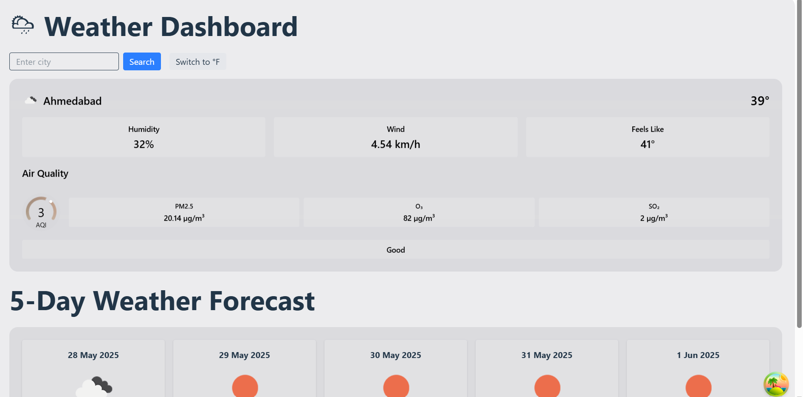

# React Weather Dashboard


A modern, responsive Weather Dashboard built with **React.js**, **TanStack React Query**, **Supabase**, and **OpenWeatherMap API**. This app allows users to:

- Search for any city to view current weather and air quality.
- Automatically detect current location on first visit.
- Save preferred city to Supabase (if logged in).
- Switch between Celsius and Fahrenheit.
- View real-time updates with API polling every 30 seconds.

---

## Features

### Search & Weather
- Search by city and get:
  - Temperature
  - Humidity
  - Wind speed
  - Weather condition (e.g., cloudy, sunny)
  - Weather icon
- View 5-day forecast 

###  Air Quality
- Displays Air Quality Index (AQI) fetched from OpenWeatherMap Air Pollution API

###  Auto-location
- On first load, app uses browser geolocation to detect and fetch weather for the user's current city

### Supabase Integration
- User authentication (Sign in / Sign up)
- Saves last searched city per user
- Fetches city from Supabase on login

###  Tech Stack

- **React.js** (Functional Components + Hooks)
- **TypeScript** (Type Safety)
- **Vite** (Project setup)
- **React Query** (API calls, caching, polling)
- **Framer Motion** (UI Animations)
- **Supabase** (Auth + Database)
- **Tailwind CSS** (Responsive styling)
- **OpenWeatherMap API** (Weather + Air Quality)

---

##  Architecture

###  State Management
- Uses **React Context API** to manage global state:
  - Current city
  - Temperature unit (°C / °F)
  - User object from Supabase
## Environment Setup

### 1. Clone the Repo

```bash
git clone https://github.com/shwetkamal-gaud/weather-dashboard.git
cd weather-dashboard
```
 ### 2. Install the Dependencies

 ```bash
npm install
```
### 3 Create .env file with following values
```bash
VITE_WEATHER_API_KEY=your-weather-api-key

VITE_SUPABASE_URL=Your-Supabase-Site-Url
VITE_SUPABASE_ANON_KEY=Your-Anon-Key
```
### 4. Run the Server

```bash
npm run dev
```

# React + TypeScript + Vite

This template provides a minimal setup to get React working in Vite with HMR and some ESLint rules.

Currently, two official plugins are available:

- [@vitejs/plugin-react](https://github.com/vitejs/vite-plugin-react/blob/main/packages/plugin-react) uses [Babel](https://babeljs.io/) for Fast Refresh
- [@vitejs/plugin-react-swc](https://github.com/vitejs/vite-plugin-react/blob/main/packages/plugin-react-swc) uses [SWC](https://swc.rs/) for Fast Refresh

## Expanding the ESLint configuration

If you are developing a production application, we recommend updating the configuration to enable type-aware lint rules:

```js
export default tseslint.config({
  extends: [
    // Remove ...tseslint.configs.recommended and replace with this
    ...tseslint.configs.recommendedTypeChecked,
    // Alternatively, use this for stricter rules
    ...tseslint.configs.strictTypeChecked,
    // Optionally, add this for stylistic rules
    ...tseslint.configs.stylisticTypeChecked,
  ],
  languageOptions: {
    // other options...
    parserOptions: {
      project: ['./tsconfig.node.json', './tsconfig.app.json'],
      tsconfigRootDir: import.meta.dirname,
    },
  },
})
```

You can also install [eslint-plugin-react-x](https://github.com/Rel1cx/eslint-react/tree/main/packages/plugins/eslint-plugin-react-x) and [eslint-plugin-react-dom](https://github.com/Rel1cx/eslint-react/tree/main/packages/plugins/eslint-plugin-react-dom) for React-specific lint rules:

```js
// eslint.config.js
import reactX from 'eslint-plugin-react-x'
import reactDom from 'eslint-plugin-react-dom'

export default tseslint.config({
  plugins: {
    // Add the react-x and react-dom plugins
    'react-x': reactX,
    'react-dom': reactDom,
  },
  rules: {
    // other rules...
    // Enable its recommended typescript rules
    ...reactX.configs['recommended-typescript'].rules,
    ...reactDom.configs.recommended.rules,
  },
})
```
